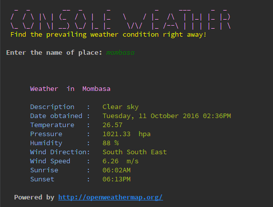

# CONSOLE WEATHER

Console weather is a tiny Python console application that can tell you the prevailing weather conditions of any (or say 
most) places on earth.

All you need is to specify the name of the area or city or region or town or village.

This application is powered by the public API provided by the awesome folk at [Open Weather Map](http://openweathermap.org/)

The screenshot below shows a sample run of Console Weather 

## Why am I doing this?

This labs are part of the Andela boot-camp set of programming assignments, which am currently participating in.

Feel free to comment on the code or ask any questions about the boot-camp.